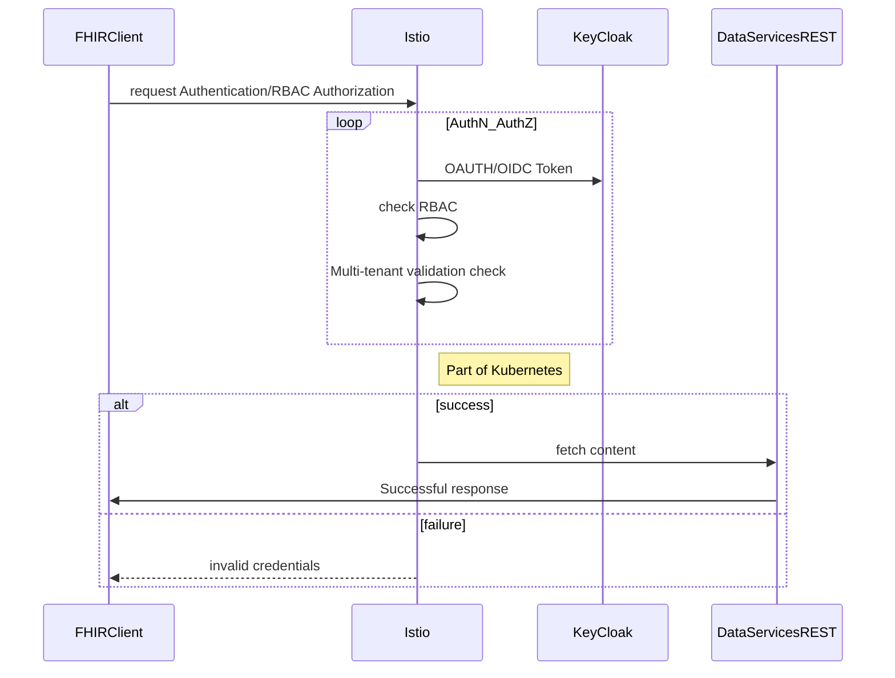

## Authorization & Authentication

### Objective:

Outline the chosen approach for authorization and authentication for the clients of the `FHIR` services.

Require minimal changes on the REST API application.

### Flow

#### Sequence Diagram

### KeyCloak:

The approach will use `KeyCloak` server to provide `OAUTH`/`OIDC` token as well as perform RBAC authorization

### Long Term:

KeyCloak provides `social logins` as well, which will enable external clients to authenticate against other providers.